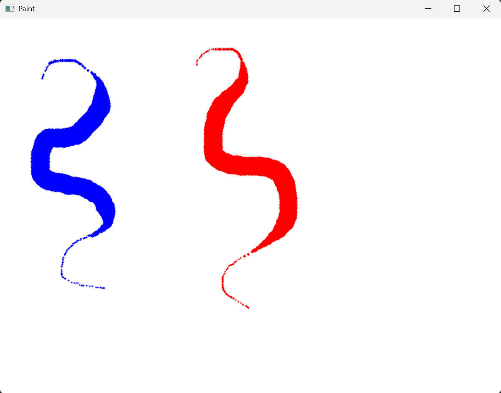
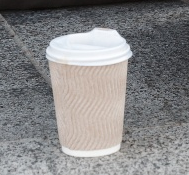

# 1주차 (E01) : OpenCV 기본 실습

## 📌 실습 01: 이미지 불러오기 및 그레이스케일 변환

### 1. 문제 정의
OpenCV를 사용하여 원본 이미지를 불러오고, 이를 그레이스케일(흑백)로 변환하여 두 이미지를 나란히 한 화면에 출력합니다.

### 2. 핵심 개념
* **`cv.imread()`**: 이미지를 BGR 배열 형태로 메모리에 불러옵니다.
* **`cv.cvtColor()`**: 이미지의 색상 공간을 변환합니다. (BGR -> GRAY)
* **`np.hstack()`**: 두 개의 이미지 배열을 가로로 이어 붙입니다. 이때 두 이미지의 채널 수가 같아야 하므로 흑백 이미지를 임시로 3채널로 변경해야 합니다.

### 3. 핵심 코드
```python
# 원본 이미지를 흑백으로 변환
gray = cv.cvtColor(img, cv.COLOR_BGR2GRAY) 

# 두 이미지를 가로로 연결하기 위해 흑백 이미지를 3채널로 변경 후 병합
gray_3c = cv.cvtColor(gray, cv.COLOR_GRAY2BGR)
result = np.hstack((img, gray_3c))
```

### 4. 전체 코드
```python
import cv2 as cv # OpenCV 라이브러리를 cv라는 이름으로 불러옵니다.
import numpy as np # 배열 처리를 위해 numpy를 np라는 이름으로 불러옵니다.

# 1. 이미지 불러오기 (OpenCV는 이미지를 BGR 형식으로 읽습니다)
img = cv.imread('soccer.jpg') 

# 원본 이미지의 해상도가 높아 화면을 벗어나는 것을 방지하기 위해 크기를 조정합니다.
# cv.resize 함수를 사용하여 이미지의 가로(fx)와 세로(fy) 비율을 각각 50%로 축소합니다.
img = cv.resize(img, None, fx=0.5, fy=0.5, interpolation=cv.INTER_AREA)

# 2. 이미지를 그레이스케일로 변환
gray = cv.cvtColor(img, cv.COLOR_BGR2GRAY) 

# 3. 원본과 병합하기 위한 차원 맞추기
# np.hstack을 하려면 채널 수가 같아야 하므로, 흑백 이미지를 3채널로 임시 변환합니다.
gray_3c = cv.cvtColor(gray, cv.COLOR_GRAY2BGR)

# 4. 두 이미지를 가로로 연결하여 출력
result = np.hstack((img, gray_3c))

# 5. 결과를 화면에 표시
cv.imshow('Result', result) 

# 6. 아무 키나 누르면 창 닫기
cv.waitKey(0) 
cv.destroyAllWindows()

```
### 5. 실행 결과 사진


---

## 📌 실습 02: 페인팅 붓 크기 조절 기능 추가

### 1. 문제 정의
마우스 입력을 통해 이미지(도화지) 위에 붓질을 하고, 키보드 입력(+, -)을 이용하여 붓의 크기를 조절하는 기능을 구현합니다. 
초기 붓 크기는 5이며, '+' 입력 시 크기가 1 증가하고 '-' 입력 시 1 감소합니다. 붓 크기는 최소 1에서 최대 15로 제한합니다. 
좌클릭 시 파란색, 우클릭 시 빨간색으로 지정하고 드래그하여 연속 그리기가 가능하며, 'q' 키를 누르면 영상 창이 종료됩니다.

### 2. 핵심 개념
* **마우스 이벤트 처리 (`cv.setMouseCallback`)**: 마우스의 클릭, 이동, 뗌 등의 이벤트를 감지하여 지정된 콜백 함수를 실행시킵니다.
* **키보드 이벤트 처리 (`cv.waitKey`)**: 루프 안에서 키 입력을 처리하여 키보드 값을 받아옵니다.
* **그리기 함수 (`cv.circle`)**: 지정된 좌표에 현재 붓 크기로 속이 꽉 찬 원(-1)을 연속으로 그려 선처럼 나타냅니다.

### 3. 핵심 코드
```python
# 키보드 입력에 따른 붓 크기 조절 (최소 1, 최대 15 제한)
if key == ord('+') or key == ord('='): 
    brush_size = min(15, brush_size + 1)
elif key == ord('-'): 
    brush_size = max(1, brush_size - 1)
```

### 4.전체 코드
```python
import cv2 as cv # OpenCV 라이브러리를 불러옵니다.
import numpy as np # 배열(도화지)을 만들기 위해 numpy 라이브러리를 불러옵니다.

brush_size = 5 # 초기 붓 크기를 5로 설정합니다.
drawing = False # 마우스 드래그 상태를 확인하기 위한 플래그 변수입니다.
color = (0, 0, 0) # 초기 그리기 색상을 검은색으로 설정합니다.

# 마우스 이벤트 처리 콜백 함수 정의
def paint(event, x, y, flags, param):
    global drawing, color, brush_size, img # 전역 변수들을 함수 내에서 사용하겠다고 선언합니다.
    
    # 좌클릭 시 파란색 설정 및 그리기 시작
    if event == cv.EVENT_LBUTTONDOWN:
        drawing = True # 그리기 상태를 켜줍니다.
        color = (255, 0, 0) # 색상을 파란색(B,G,R)으로 변경합니다.
        cv.circle(img, (x, y), brush_size, color, -1) # 현재 위치에 원을 그립니다.
        
    # 우클릭 시 빨간색 설정 및 그리기 시작
    elif event == cv.EVENT_RBUTTONDOWN:
        drawing = True # 그리기 상태를 켜줍니다.
        color = (0, 0, 255) # 색상을 빨간색(B,G,R)으로 변경합니다.
        cv.circle(img, (x, y), brush_size, color, -1) # 현재 위치에 원을 그립니다.
        
    # 마우스 이동 시 연속 그리기
    elif event == cv.EVENT_MOUSEMOVE:
        if drawing: # 그리기 상태일 때만 동작합니다.
            cv.circle(img, (x, y), brush_size, color, -1) # 마우스 궤적을 따라 원을 그립니다.
            
    # 마우스 클릭 해제 시 그리기 종료
    elif event == cv.EVENT_LBUTTONUP or event == cv.EVENT_RBUTTONUP:
        drawing = False # 그리기 상태를 끕니다.

# [수정된 부분] 이미지 로드 대신 세로 600, 가로 800 크기의 하얀색 배경 캔버스 생성
img = np.ones((600, 800, 3), dtype=np.uint8) * 255 

cv.namedWindow('Paint') # 'Paint'라는 이름의 창을 생성합니다.
cv.setMouseCallback('Paint', paint) # 'Paint' 창에 마우스 이벤트 콜백 함수를 연결합니다.

while True: # 무한 루프를 돌며 창을 갱신합니다.
    cv.imshow('Paint', img) # 이미지를 화면에 보여줍니다.
    
    key = cv.waitKey(1) & 0xFF # 1ms 동안 키보드 입력을 대기하고 값을 받습니다.
    
    if key == ord('q'): # 'q' 키를 누르면 종료합니다.
        break # 무한 루프를 빠져나갑니다.
    elif key == ord('+') or key == ord('='): # '+' 키를 누르면 (Shift 없이 눌리는 '='도 포함)
        brush_size = min(15, brush_size + 1) # 붓 크기를 1 증가시키되, 최대 15로 제한합니다.
    elif key == ord('-'): # '-' 키를 누르면
        brush_size = max(1, brush_size - 1) # 붓 크기를 1 감소시키되, 최소 1로 제한합니다.

cv.destroyAllWindows() # 모든 창을 닫고 프로그램을 종료합니다.
```

### 5. 실행 결과 사진


📌 실습 03: 마우스로 영역 선택 및 ROI(관심영역) 추출
1. 문제 정의
이미지를 불러오고 사용자가 마우스로 클릭 및 드래그하여 관심영역(ROI)을 선택합니다.
마우스를 놓으면 해당 영역을 잘라내서 별도의 창에 출력합니다. 'r' 키를 누르면 영역 선택을 리셋하고, 's' 키를 누르면 선택한 영역을 이미지 파일로 저장합니다.

2. 핵심 개념
Numpy 배열 슬라이싱: 드래그 시작점과 끝점을 통해 얻은 좌표계를 이용해 이미지 배열에서 원하는 특정 범위만 잘라내어 ROI를 추출합니다.

도형 그리기 (cv.rectangle): 드래그 중인 영역을 직관적으로 시각화하기 위해 사각형을 화면에 그립니다.

파일 저장 (cv.imwrite) 및 대화상자 (tkinter): 추출된 ROI를 사용자가 지정한 이름과 경로로 저장합니다.

3. 핵심 코드
Python
# ROI 추출 (마우스 시작점과 끝점 좌표 정렬 후 슬라이싱)
x1, x2 = min(ix, fx), max(ix, fx)
y1, y2 = min(iy, fy), max(iy, fy)
roi = clone[y1:y2, x1:x2]

# 파일 저장 창 띄우기 및 저장
save_path = filedialog.asksaveasfilename(title="저장 위치 선택", defaultextension=".jpg")
if save_path:
    cv.imwrite(save_path, roi)

---

## 📌 실습 03: 마우스로 영역 선택 및 ROI(관심영역) 추출

### 1. 문제 정의
[cite_start]이미지를 불러오고 사용자가 마우스로 클릭 및 드래그하여 관심영역(ROI)을 선택합니다[cite: 52]. [cite_start]마우스를 놓으면 해당 영역을 잘라내서 별도의 창에 출력합니다[cite: 60]. [cite_start]'r' 키를 누르면 영역 선택을 리셋하고 [cite: 61][cite_start], 's' 키를 누르면 선택한 영역을 이미지 파일로 저장합니다[cite: 62].

### 2. 핵심 개념
* [cite_start]**Numpy 배열 슬라이싱**: 드래그 시작점과 끝점을 통해 얻은 좌표계를 이용해 이미지 배열에서 원하는 특정 범위만 잘라내어 ROI를 추출합니다[cite: 64].
* [cite_start]**도형 그리기 (`cv.rectangle`)**: 드래그 중인 영역을 직관적으로 시각화하기 위해 사각형을 화면에 그립니다[cite: 63].
* [cite_start]**파일 저장 (`cv.imwrite`) 및 대화상자 (`tkinter`)**: 추출된 ROI를 사용자가 지정한 이름과 경로로 저장합니다[cite: 65].

### 3. 핵심 코드
```python
# ROI 추출 (마우스 시작점과 끝점 좌표 정렬 후 슬라이싱)
x1, x2 = min(ix, fx), max(ix, fx)
y1, y2 = min(iy, fy), max(iy, fy)
roi = clone[y1:y2, x1:x2]

# 파일 저장 창 띄우기 및 저장
save_path = filedialog.asksaveasfilename(title="저장 위치 선택", defaultextension=".jpg")
if save_path:
    cv.imwrite(save_path, roi)
```

### 4. 전체 코드
```python
import cv2 as cv # OpenCV 라이브러리를 불러옵니다.
import tkinter as tk # 폴더 창을 띄우기 위해 tkinter 라이브러리를 불러옵니다.
from tkinter import filedialog

# 폴더 창(탐색기)을 사용하기 위한 기본 설정 (메인 창은 숨깁니다)
root = tk.Tk()
root.withdraw() 

drawing = False # 드래그 상태를 확인하는 변수입니다.
ix, iy = -1, -1 # 드래그 시작 좌표(x, y)를 초기화합니다.
fx, fy = -1, -1 # 드래그 종료 좌표(x, y)를 초기화합니다.

img = cv.imread('girl_laughing.jpg') # 작업할 이미지를 불러옵니다.
clone = img.copy() # 원본 이미지를 훼손하지 않기 위해 복사본을 만듭니다.

# 마우스 이벤트 처리 함수
def select_roi(event, x, y, flags, param):
    global ix, iy, fx, fy, drawing, img, clone # 전역 변수 사용을 선언합니다.
    
    if event == cv.EVENT_LBUTTONDOWN: # 마우스 왼쪽 버튼을 누르면 시작
        drawing = True # 드래그 상태 활성화
        ix, iy = x, y # 시작점 좌표 저장
        
    elif event == cv.EVENT_MOUSEMOVE: # 마우스를 이동할 때
        if drawing: # 드래그 중이라면
            img = clone.copy() # 화면 갱신을 위해 복사본 이미지를 가져옵니다.
            cv.rectangle(img, (ix, iy), (x, y), (0, 255, 0), 2) # 드래그 중인 영역을 녹색 사각형으로 시각화합니다.
            
    elif event == cv.EVENT_LBUTTONUP: # 마우스 왼쪽 버튼을 떼면 종료
        drawing = False # 드래그 상태 비활성화
        fx, fy = x, y # 종료점 좌표 저장
        cv.rectangle(img, (ix, iy), (fx, fy), (0, 255, 0), 2) # 최종 사각형을 그립니다.
        
        # 좌상단, 우하단 좌표 정렬 (드래그 방향에 상관없이 ROI를 추출하기 위함)
        x1, x2 = min(ix, fx), max(ix, fx)
        y1, y2 = min(iy, fy), max(iy, fy)
        
        # 유효한 영역이 선택되었는지 확인
        if x2 - x1 > 0 and y2 - y1 > 0:
            roi = clone[y1:y2, x1:x2] # numpy 슬라이싱으로 선택 영역(ROI)만 잘라냅니다.
            cv.imshow('ROI', roi) # 잘라낸 ROI를 'ROI'라는 새 창에 출력합니다.

cv.namedWindow('Image') # 'Image'라는 이름의 메인 창을 만듭니다.
cv.setMouseCallback('Image', select_roi) # 메인 창에 마우스 이벤트를 연결합니다.

while True:
    cv.imshow('Image', img) # 메인 이미지를 계속 업데이트하여 보여줍니다.
    key = cv.waitKey(1) & 0xFF # 키 입력을 대기합니다.
    
    # -------------------------------------------------------------
    # [추가된 부분] 창의 'X' 버튼을 누르면 루프를 종료합니다.
    # WND_PROP_VISIBLE 속성은 창이 열려있으면 1, 닫히면 0을 반환합니다.
    # -------------------------------------------------------------
    if cv.getWindowProperty('Image', cv.WND_PROP_VISIBLE) < 1:
        break

    if key == ord('r'): # 'r' 키를 누르면 리셋
        img = clone.copy() # 이미지를 원본 복사본으로 되돌립니다.
        ix, iy, fx, fy = -1, -1, -1, -1 # 좌표를 초기화합니다.
        
        # ROI 창이 열려있는지 확인하고, 열려있다면 닫기
        try:
            if cv.getWindowProperty('ROI', cv.WND_PROP_VISIBLE) >= 0:
                cv.destroyWindow('ROI') 
        except cv.error:
            pass # 창이 이미 닫혀있어서 에러가 나면 그냥 무시합니다.
            
    elif key == ord('s'): # 's' 키를 누르면 저장
        x1, x2 = min(ix, fx), max(ix, fx)
        y1, y2 = min(iy, fy), max(iy, fy)
        if x2 - x1 > 0 and y2 - y1 > 0: # 유효한 영역이 있다면
            roi = clone[y1:y2, x1:x2]
            
            # '다른 이름으로 저장' 탐색기 창을 띄웁니다.
            save_path = filedialog.asksaveasfilename(
                title="ROI 저장 위치 선택",
                defaultextension=".jpg",
                filetypes=[("JPEG", "*.jpg"), ("PNG", "*.png"), ("All Files", "*.*")]
            )
            
            # 사용자가 취소하지 않고 경로를 지정했다면 저장
            if save_path:
                cv.imwrite(save_path, roi) # 선택한 경로와 이름으로 이미지 저장
                print(f"이미지가 저장되었습니다: {save_path}")
            else:
                print("저장이 취소되었습니다.")
            
    elif key == ord('q'): # 혹시 몰라 'q'로 종료하는 기능도 그대로 남겨두었습니다.
        break 

cv.destroyAllWindows() # 모든 창을 닫습니다.
```

### 5. 실행 결과 사진
