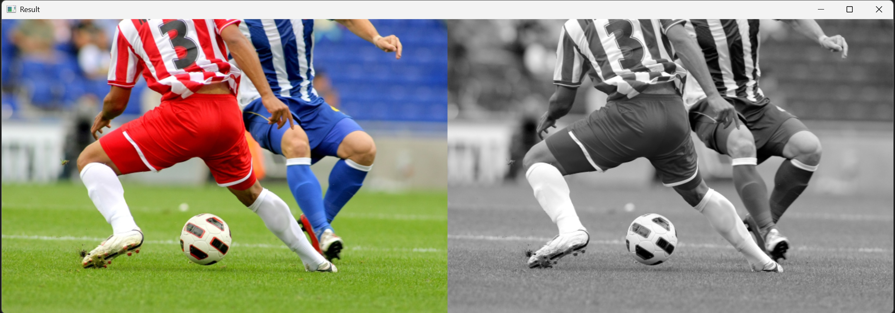

# 1주차 (E01) : OpenCV 기본 실습

## 📌 실습 01: 이미지 불러오기 및 그레이스케일 변환

### 1. 문제 정의
OpenCV를 사용하여 원본 이미지를 불러오고, 이를 그레이스케일(흑백)로 변환하여 두 이미지를 나란히 한 화면에 출력합니다.

### 2. 핵심 개념
* **`cv.imread()`**: 이미지를 BGR 배열 형태로 메모리에 불러옵니다.
* **`cv.cvtColor()`**: 이미지의 색상 공간을 변환합니다. (BGR -> GRAY)
* **`np.hstack()`**: 두 개의 이미지 배열을 가로로 이어 붙입니다. 이때 두 이미지의 채널 수가 같아야 하므로 흑백 이미지를 임시로 3채널로 변경해야 합니다.

### 3. 핵심 코드
```python
# 원본 이미지를 흑백으로 변환
gray = cv.cvtColor(img, cv.COLOR_BGR2GRAY) 

# 두 이미지를 가로로 연결하기 위해 흑백 이미지를 3채널로 변경 후 병합
gray_3c = cv.cvtColor(gray, cv.COLOR_GRAY2BGR)
result = np.hstack((img, gray_3c))
```

### 4. 전체 코드
```python
<details>
<summary>코드 전체 보기 (클릭)</summary>
import cv2 as cv # OpenCV 라이브러리를 cv라는 이름으로 불러옵니다.
import numpy as np # 배열 처리를 위해 numpy를 np라는 이름으로 불러옵니다.

# 1. 이미지 불러오기 (OpenCV는 이미지를 BGR 형식으로 읽습니다)
img = cv.imread('soccer.jpg') 

# 원본 이미지의 해상도가 높아 화면을 벗어나는 것을 방지하기 위해 크기를 조정합니다.
# cv.resize 함수를 사용하여 이미지의 가로(fx)와 세로(fy) 비율을 각각 50%로 축소합니다.
img = cv.resize(img, None, fx=0.5, fy=0.5, interpolation=cv.INTER_AREA)

# 2. 이미지를 그레이스케일로 변환
gray = cv.cvtColor(img, cv.COLOR_BGR2GRAY) 

# 3. 원본과 병합하기 위한 차원 맞추기
# np.hstack을 하려면 채널 수가 같아야 하므로, 흑백 이미지를 3채널로 임시 변환합니다.
gray_3c = cv.cvtColor(gray, cv.COLOR_GRAY2BGR)

# 4. 두 이미지를 가로로 연결하여 출력
result = np.hstack((img, gray_3c))

# 5. 결과를 화면에 표시
cv.imshow('Result', result) 

# 6. 아무 키나 누르면 창 닫기
cv.waitKey(0) 
cv.destroyAllWindows()

</details>
```
### 5. 실행 결과 사진

